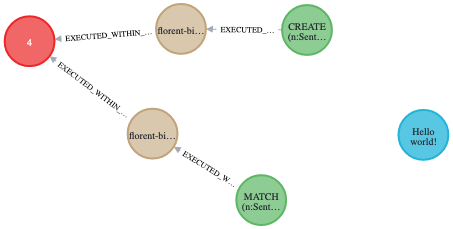

# Liquigraph to Liquibase migration

## Step 0: Start Neo4j

### Prerequisites

You will need [Docker](https://www.docker.com/) for this.

### 🎬 Action!

Run `00-start-neo4j.sh` to start a Neo4j container in the background, with specific credentials: 
 - `neo4j` as username
 - `s3cr3t` as password
 
The script should stop once the container is healthy (i.e. Neo4j is ready to accept Bolt connections).
As a sanity check, you can run `docker ps | grep neo4j` and see Neo4j running and marked as healthy.

## Step 1: Run Liquigraph

### Prerequisites

You will need the latest version of Liquigraph.
The best way to this is build Liquigraph [from sources](https://github.com/liquibase/liquigraph/).
For that, you will need a [JDK 11](https://www.azul.com/downloads/?version=java-11-lts&package=jdk) (or 8) 
and [Apache Maven](https://maven.apache.org/download.cgi).
As a sanity check, you can run the following commands:

```shell
javac --version
java --version
mvn --version
```
They should all point to the same installed JDK, otherwise you have a setup issue.
For instance, the output on my machine is:
```shell
➜  javac --version
javac 11.0.14
➜  java --version
openjdk 11.0.14 2022-01-18 LTS
OpenJDK Runtime Environment Zulu11.54+23-CA (build 11.0.14+9-LTS)
OpenJDK 64-Bit Server VM Zulu11.54+23-CA (build 11.0.14+9-LTS, mixed mode)
➜  mvn --version
Apache Maven 3.8.1 (05c21c65bdfed0f71a2f2ada8b84da59348c4c5d)
Maven home: ~/.sdkman/candidates/maven/current
Java version: 11.0.14, vendor: Azul Systems, Inc., runtime: ~/.sdkman/candidates/java/11.0.14-zulu/zulu-11.jdk/Contents/Home
Default locale: en_FR, platform encoding: UTF-8
OS name: "mac os x", version: "12.1", arch: "x86_64", family: "mac"
```

You will also need [Git](https://git-scm.com/downloads) to check out Liquigraph sources.
Then, assuming you are currently in the root folder of this project, run:

```shell
cli=$(pwd)
cd $(mktemp -d)
git clone https://github.com/liquibase/liquigraph/
mvn --quiet --file liquigraph --also-make --projects liquigraph-cli package -DskipTests
unzip -o liquigraph/liquigraph-cli/target/liquigraph-cli-bin.zip -d "${cli}"
cd -
```

**For Windows users: you will have to change every occurrence of `liquigraph.sh` with `liquigraph.bat`.**

### 🎬 Action!

Run `01-run-liquigraph-change-sets.sh`.

Open `localhost:7474`, authenticate with `neo4j`/`s3cr3t` and run the query `MATCH (n) RETURN n`.
You should see something similar to this:



This is the data itself (the `Movie` node with `Hello world!`), as well as the history graph maintained by Liquigraph 
to remember what it ran.

## Step 2: Migrate to Liquibase

### 🎬 Action!

Run `02-migrate.sh`.

You should a new file named `liquibase.xml` has been generated:
```xml
<?xml version="1.1" encoding="UTF-8" standalone="no"?>
<databaseChangeLog xmlns="http://www.liquibase.org/xml/ns/dbchangelog" xmlns:ext="http://www.liquibase.org/xml/ns/dbchangelog-ext" xmlns:pro="http://www.liquibase.org/xml/ns/pro" xmlns:xsi="http://www.w3.org/2001/XMLSchema-instance" xsi:schemaLocation="http://www.liquibase.org/xml/ns/dbchangelog-ext http://www.liquibase.org/xml/ns/dbchangelog/dbchangelog-ext.xsd http://www.liquibase.org/xml/ns/pro http://www.liquibase.org/xml/ns/pro/liquibase-pro-4.1.xsd http://www.liquibase.org/xml/ns/dbchangelog http://www.liquibase.org/xml/ns/dbchangelog/dbchangelog-4.1.xsd">
    <changeSet author="florent-biville" context="foo,bar" id="sentence-initialization" objectQuotingStrategy="LEGACY" runOnChange="true">
        <sql splitStatements="true" stripComments="false">CREATE (n:Sentence {text:"Hello monde!"})</sql>
    </changeSet>
    <changeSet author="florent-biville" context="bar,baz" id="sentence-correction" objectQuotingStrategy="LEGACY" runAlways="true">
        <preConditions onError="HALT" onFail="HALT" onSqlOutput="IGNORE">
            <or>
                <sqlCheck expectedResult="true">RETURN false AS result</sqlCheck>
                <and>
                    <sqlCheck expectedResult="true">RETURN true AS result</sqlCheck>
                    <sqlCheck expectedResult="true">RETURN true AS result</sqlCheck>
                </and>
            </or>
        </preConditions>
        <sql splitStatements="true" stripComments="false">MATCH (n:Sentence {text:"Hello monde!"}) SET n.text="Hello world!"</sql>
    </changeSet>
</databaseChangeLog>
```

This is the Liquibase XML equivalent of Liquigraph XML migrations.

Open again `localhost:7474`, authenticate with `neo4j`/`s3cr3t` and run the query `MATCH (n) RETURN n`.
You should now see something similar to this:


By default, `migrate-to-liquibase` keeps the Liquigraph history graph intact.
Here however, `--delete` is used which is why only the Liquibase history graph can be seen.

## (Optional) Step 3: Run Liquibase

### Prerequisites

You need to:

 - install the [Liquibase CLI](https://liquibase.org/download)
 - download the JAR file of the [Liquibase Neo4j plugin](https://github.com/liquibase/liquibase-neo4j/releases/tag/liquibase-neo4j-4.7.0.2)
and drop it to the `lib` folder of Liquibase
 - download the JAR file of the [Neo4j JDBC driver](https://github.com/neo4j-contrib/neo4j-jdbc/releases/tag/4.0.4) and 
drop it to the `lib` folder of Liquibase

Note: The scripts assume that the CLI name is `liquibase`.

### 🎬 Action!

Run `03-run-liquibase.sh`.

If you open `localhost:7474` again and run the same query as before (`MATCH (n) RETURN n`), you should see the same results
as in step 2.

As an optional experiment, you can run this step against an empty database.
The result should also be the same.
